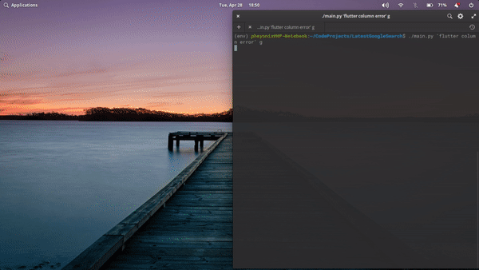

## LatestStackoverflowSearchTool

Simple python tool that takes away the pain of opening a browser and searching the search phrase while adding the dork for getting stackoverflow specific answers, and changing the search settings to return only answers from past year

---

## LatestStackoverflowSearchTool Demo

 

---
## Usage

> Clone the Git Repository

`$ git clone https://github.com/VishnuDileesh/LatestStackoverflowSearchTool.git`

> Change to the cloned Repository folder

`$ cd LatestStackoverflowSearchTool`

> Install the necessary packages

`$ pip3 install -r requirements.txt`

> Run the tool with google search engine as the choice

`$ python3 main.py 'search phrase in quotes' g` 

> Run the tool with duckduckgo search engine as the choice

`$ python3 main.py 'search phrase in quotes' d`

---

It's a fun little tool built on Helium (web automation package) to make my life easier for googling while coding, as i code in vim editor, all i have to do is to jumb into terminal, and type in the commands, and i get my latest sweet little search results from stackoverflow 
